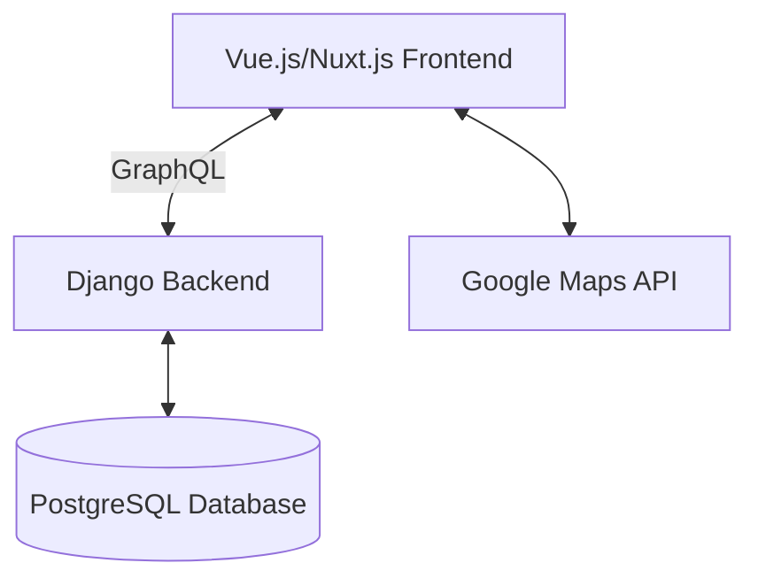
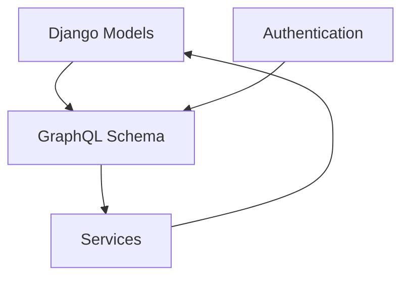
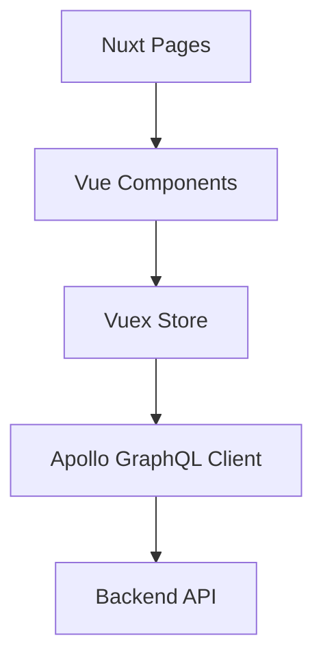
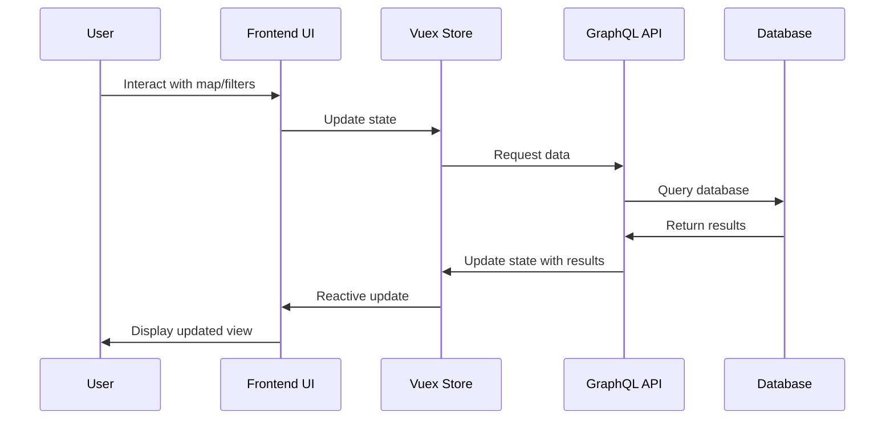
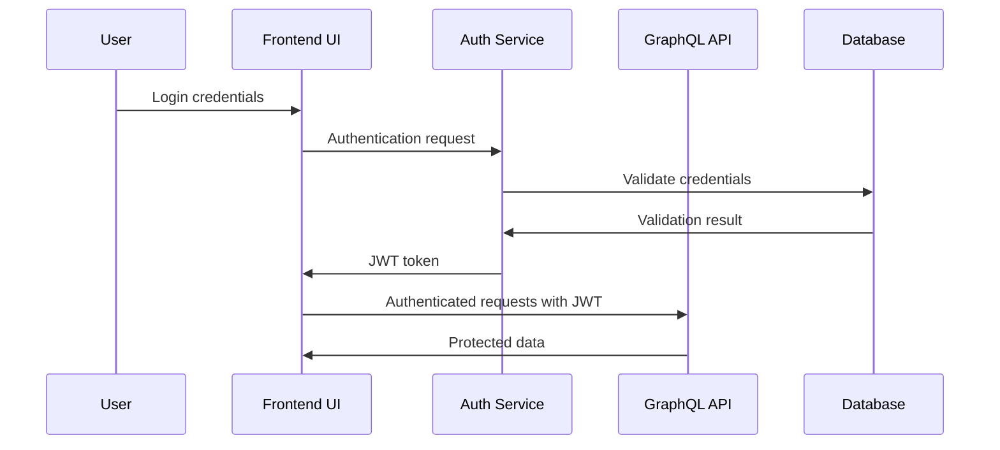

# System Patterns

## Architecture Overview

OWSwims follows a client-server architecture with a clear separation between the frontend and backend:

## Backend Architecture

The backend follows a Django-based architecture with GraphQL for API communication:

### Key Components

1. **Models**: Django ORM models representing the data structure
   - Location
   - Event
   - Race
   - Organizer
   - Review

2. **GraphQL API**: Provides a flexible query interface for the frontend
   - Queries: Data retrieval operations
   - Mutations: Data modification operations
   - Filters: Complex filtering capabilities

3. **Services**: Business logic encapsulation
   - Event verification
   - Location management
   - Rating calculations

## Frontend Architecture

The frontend follows a Nuxt.js architecture with Vue components:

### Key Components

1. **Map Component**: Core interactive map using Google Maps
   - Location markers
   - Clustering
   - Race track visualization

2. **Filter Components**: User interface for filtering events
   - DaterangeSlider
   - Distance filters
   - Keyword search

3. **Event Display**: Components for showing event details
   - EventPane
   - Reviews
   - Race information

4. **State Management**: Vuex store for application state
   - User preferences
   - Selected locations
   - Filter settings

## Design Patterns

1. **Repository Pattern**: Used in the Django models to encapsulate data access logic

2. **Component-Based Architecture**: Frontend is built with reusable Vue components

3. **Flux Pattern**: Implemented via Vuex for unidirectional data flow

4. **Observer Pattern**: Used for reactive updates in the Vue.js components

5. **Factory Pattern**: Used for creating complex objects like map markers

## Data Flow

## Authentication Flow

## Key Technical Decisions

1. **GraphQL over REST**: Provides more flexible querying capabilities and reduces over-fetching

2. **Django + PostgreSQL**: Robust ORM and relational database for complex data relationships

3. **Vue.js + Nuxt.js**: Component-based frontend with server-side rendering capabilities

4. **Google Maps Integration**: Industry-standard mapping solution with extensive features

5. **JWT Authentication**: Stateless authentication for scalability
