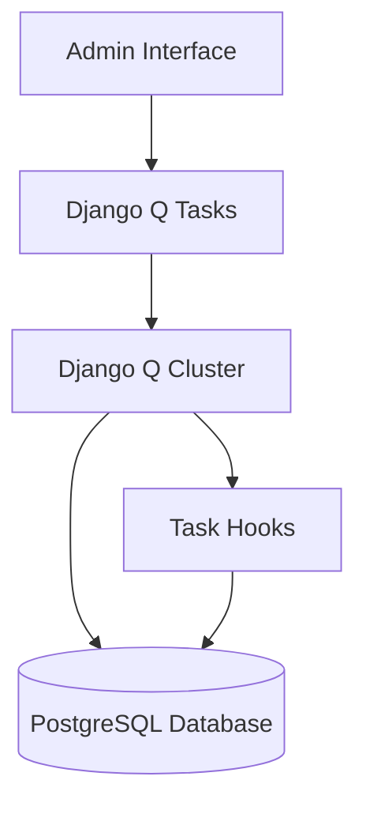
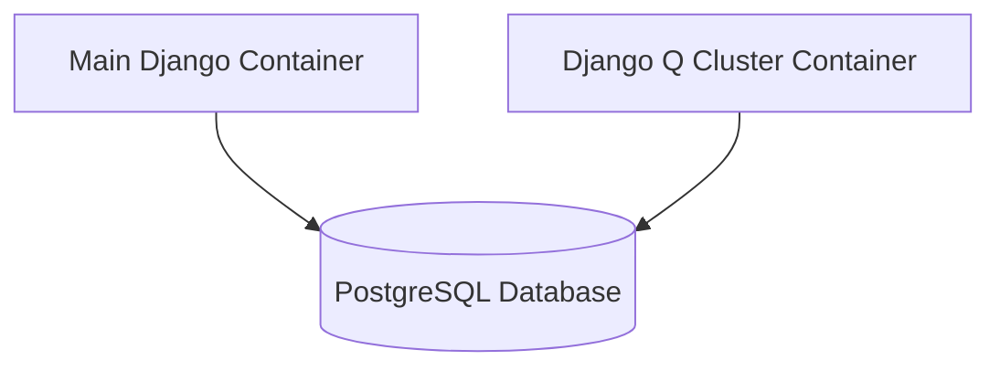
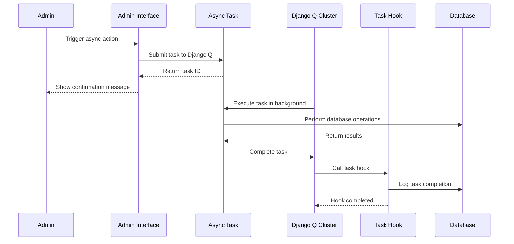
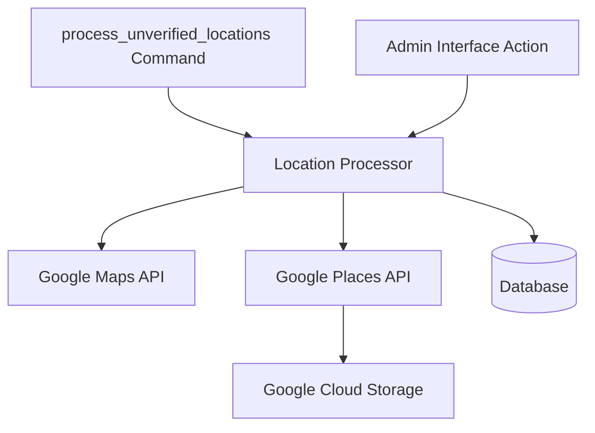
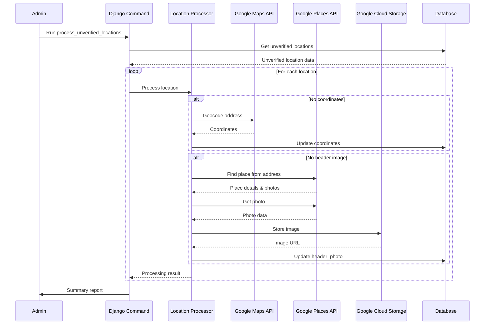

# System Patterns

## Architecture Overview

OWSwims follows a client-server architecture with a clear separation between the frontend and backend:

## Backend Architecture

The backend follows a Django-based architecture with GraphQL for API communication:

### Key Components

1. **Models**: Django ORM models representing the data structure
   - Location
   - Event
   - Race
   - Organizer
   - Review

2. **GraphQL API**: Provides a flexible query interface for the frontend
   - Queries: Data retrieval operations
   - Mutations: Data modification operations
   - Filters: Complex filtering capabilities

3. **Services**: Business logic encapsulation
   - Event verification
   - Location management and verification
   - Rating calculations
   - Event crawling and processing
   - Automated location processing

## Frontend Architecture

The frontend follows a Nuxt.js architecture with Vue components:

### Key Components

1. **Map Component**: Core interactive map using Google Maps
   - Location markers
   - Clustering
   - Race track visualization

2. **Filter Components**: User interface for filtering events
   - DaterangeSlider
   - Distance filters
   - Keyword search

3. **Event Display**: Components for showing event details
   - EventPane
   - Reviews
   - Race information

4. **State Management**: Vuex store for application state
   - User preferences
   - Selected locations
   - Filter settings

## Design Patterns

1. **Repository Pattern**: Used in the Django models to encapsulate data access logic

2. **Component-Based Architecture**: Frontend is built with reusable Vue components

3. **Flux Pattern**: Implemented via Vuex for unidirectional data flow

4. **Observer Pattern**: Used for reactive updates in the Vue.js components

5. **Factory Pattern**: Used for creating complex objects like map markers

## Data Flow

## Authentication Flow

## Key Technical Decisions

1. **GraphQL over REST**: Provides more flexible querying capabilities and reduces over-fetching

2. **Django + PostgreSQL**: Robust ORM and relational database for complex data relationships

3. **Vue.js + Nuxt.js**: Component-based frontend with server-side rendering capabilities

4. **Google Maps Integration**: Industry-standard mapping solution with extensive features

5. **JWT Authentication**: Stateless authentication for scalability

6. **LLM-based Crawling System**: Agent-based approach for automated event data extraction

7. **Django Q for Asynchronous Processing**: Task queue for handling time-consuming operations in the background

## Event Crawling System

The event crawling system uses LLM-based agents to automate the extraction of swimming event data from websites:

### Key Components

1. **Django Management Command**: Entry point for the crawling system
   - `crawl_events.py`: Main command for crawling and processing events
   - Supports single event processing, multi-event crawling, and profile-based crawling
   - `list_crawl_profiles.py`: Command to list available crawl profiles

2. **Event Crawler**: Finds event URLs from swimming event websites
   - Uses LLM agent to identify and extract event URLs
   - Groups related URLs for the same event
   - Supports crawl profiles for website-specific interactions

3. **Event Processor**: Extracts structured data from event pages
   - Uses LLM agent to parse and extract event details
   - Maps extracted data to database models

4. **Scraping Service**: Handles web page content extraction
   - Uses Firecrawl API for reliable web scraping
   - Optimized for event page content
   - Supports actions from crawl profiles for interactive scraping

5. **Crawl Profiles**: Configuration files for website-specific interactions
   - JSON files with website-specific actions
   - Supports various action types (wait, click, scroll, etc.)
   - Enables scraping of sites requiring user interaction

### Data Flow

## Asynchronous Processing System

The asynchronous processing system uses Django Q to handle time-consuming operations in the background:

### Key Components

1. **Django Q Cluster**: Background worker process that executes tasks
   - Configured in `settings.py` with parameters for workers, timeouts, etc.
   - Runs as a separate process from the Django server
   - Can be started via VS Code launch configuration or command line

2. **Asynchronous Tasks**: Functions that run in the background
   - `crawl_single_event_async`: Crawls a single event asynchronously
   - `verify_locations_async`: Verifies locations asynchronously
   - `process_event_urls_async`: Processes event URLs asynchronously

3. **Task Hooks**: Functions that run after task completion
   - Log task completion status
   - Create admin log entries for successful tasks
   - Log errors for failed tasks

4. **Admin Interface Integration**: Custom actions in the admin interface
   - "Crawl Single Event" action for events
   - "Process selected unverified locations" action for locations

### Benefits

- Improved user experience by keeping the admin interface responsive
- Better resource utilization through distributed task processing
- Reliability with automatic retry for failed tasks
- Scalability by adjusting the number of workers

### Deployment

The Django Q cluster is deployed as a separate container in Kubernetes:

- Both containers use the same Docker image
- The Django Q container runs the `python manage.py qcluster` command
- Both containers share the same environment variables and secrets
- The Django Q container can be enabled/disabled via configuration
- Resource limits can be configured separately for the Django Q container

### Data Flow

## Location Verification System

The location verification system automates the process of verifying and enhancing location data:

### Key Components

1. **Django Management Command**: Entry point for batch processing
   - `process_unverified_locations.py`: Command for processing unverified locations
   - Supports limiting the number of locations to process
   - Option for automatic verification after processing
   - Dry run mode for testing

2. **Admin Interface Integration**: Allows processing from the admin UI
   - Custom admin action for processing selected locations
   - Filtering for unverified locations
   - Detailed feedback on processing results

3. **Location Processor**: Core processing logic
   - Geocoding using the full address field
   - Place search using Google Places API
   - Header image selection from place photos
   - Coordinate refinement from identified places

4. **Multi-Strategy Approach**: Fallback mechanisms for reliability
   - Primary: Find place from address (matching frontend behavior)
   - Secondary: Text search with address
   - Tertiary: Nearby search with water type-specific place types

### Data Flow

