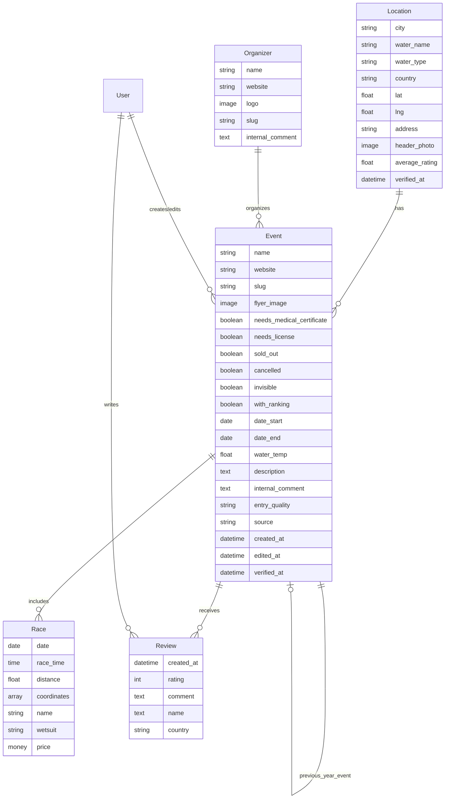
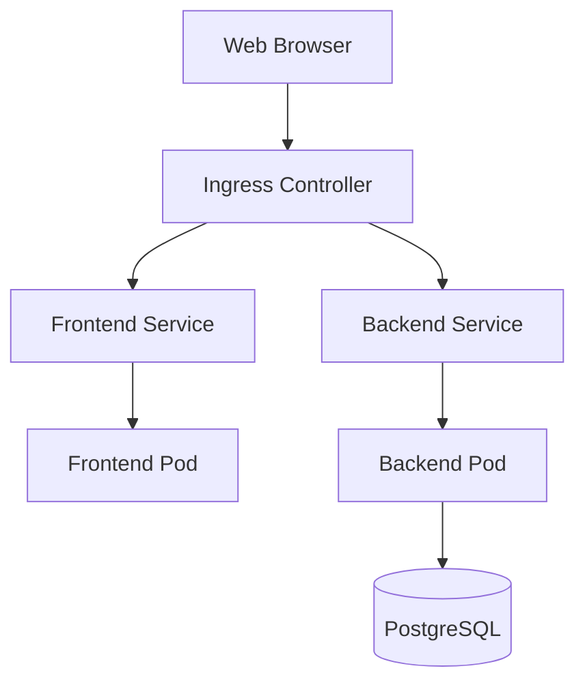

# Technical Context

## Technology Stack

### Backend
- **Framework**: Django (Python)
- **API**: GraphQL with Graphene-Django
- **Database**: PostgreSQL
- **Authentication**: JWT (JSON Web Tokens) with graphql-auth
- **Geospatial**: django-google-maps
- **Error Tracking**: Sentry
- **Email**: SparkPost
- **Web Scraping**: Firecrawl API with action profiles
- **LLM Integration**: OpenAI GPT-4o with llama-index
- **Asynchronous Processing**: Django Q

### Frontend
- **Framework**: Vue.js with Nuxt.js
- **State Management**: Vuex
- **API Client**: Apollo GraphQL Client
- **UI Components**: Custom Vue components with Tailwind CSS
- **Maps**: Google Maps JavaScript API
- **Date Handling**: date-fns
- **Internationalization**: vue-i18n
- **Form Components**: vue-slider-component, vue2-datepicker

### DevOps
- **Containerization**: Docker
- **CI/CD**: GitLab CI
- **Deployment**: Helm charts for Kubernetes
- **Version Control**: Git

## Development Environment

### Requirements
- Python 3.x
- Node.js and npm/yarn
- PostgreSQL
- Docker (optional)
- VS Code (recommended editor)

### Local Setup
1. Clone the repository
2. Set up the backend:
   ```
   cd backend
   pip install -r requirements.txt
   python manage.py migrate
   python manage.py runserver
   ```
3. Set up the frontend:
   ```
   cd frontend
   npm install
   npm run dev
   ```

### Environment Variables
Key environment variables required for the application:
- `SECRET_KEY`: Django secret key
- `DEBUG`: Boolean for debug mode
- `DB_*`: Database connection parameters
- `GOOGLE_MAPS_API_KEY`: API key for Google Maps
- `FRONTEND_URL`: URL of the frontend application
- `SPARKPOST_API_KEY`: API key for email service
- `FIRECRAWL_API_KEY`: API key for Firecrawl web scraping service
- `OPENAI_API_KEY`: API key for OpenAI (used by the event crawling system)

## API Structure

### GraphQL Schema
The API is built around these main types:
- `Location`: Geographic locations where events take place
- `Event`: Swimming events with dates and details
- `Race`: Individual races within an event with specific distances
- `Organizer`: Organizations that run events
- `Review`: User reviews and ratings for events

### Key Queries
- `locationsFiltered`: Get locations based on filters
- `allEvents`: Get events with optional filtering
- `statistics`: Get system-wide statistics

### Key Mutations
- `updateEvent`: Modify event details
- `updateLocation`: Update location information
- `updateRace`: Update race details including coordinates
- `rateEvent`: Submit a review for an event
- `sendContactmail`: Send contact form messages

## Database Schema

The database follows Django's ORM structure with these key models:



## External Integrations

### Google Maps
- Used for displaying the interactive map
- Geocoding for location search
- Distance calculations for travel time estimates
- Drawing race tracks on the map

### SparkPost
- Email service for contact form submissions
- Used for transactional emails

### Sentry
- Error tracking and monitoring
- Performance monitoring

## Testing

- Backend: Django test framework with pytest
- Frontend: Cypress for end-to-end testing

## Deployment Architecture

The application is deployed using Kubernetes with Helm charts:



## Security Considerations

- JWT authentication for API access
- HTTPS for all communications
- Environment variables for sensitive configuration
- Input validation on both frontend and backend
- CSRF protection
- Content Security Policy
